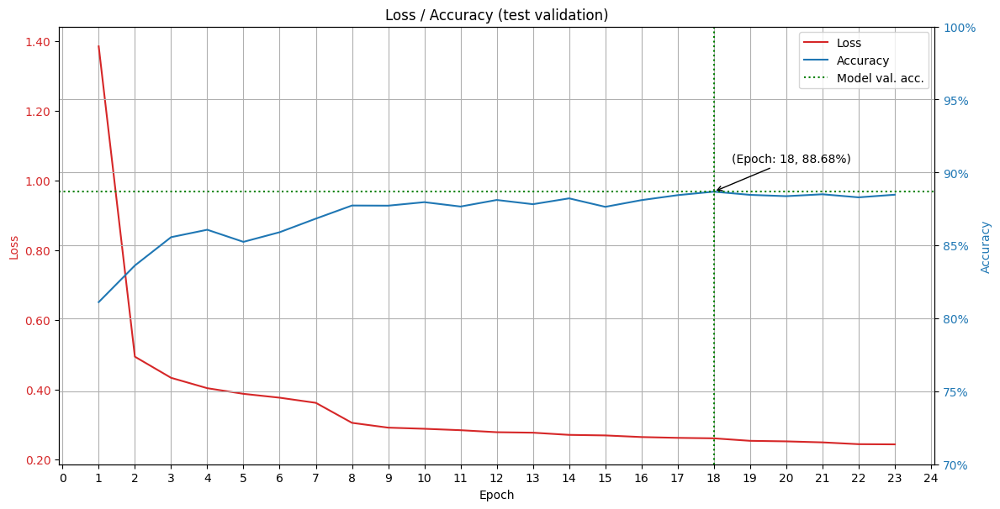
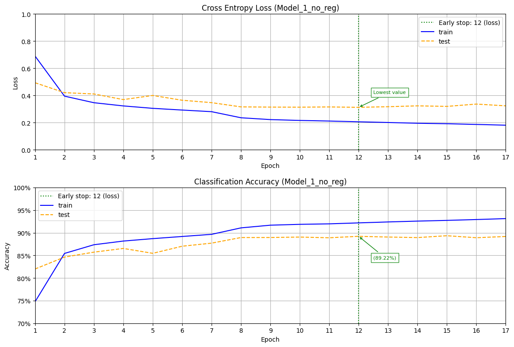
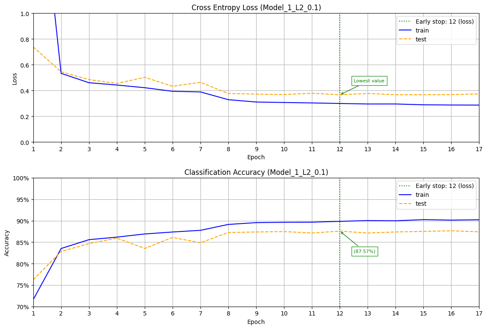
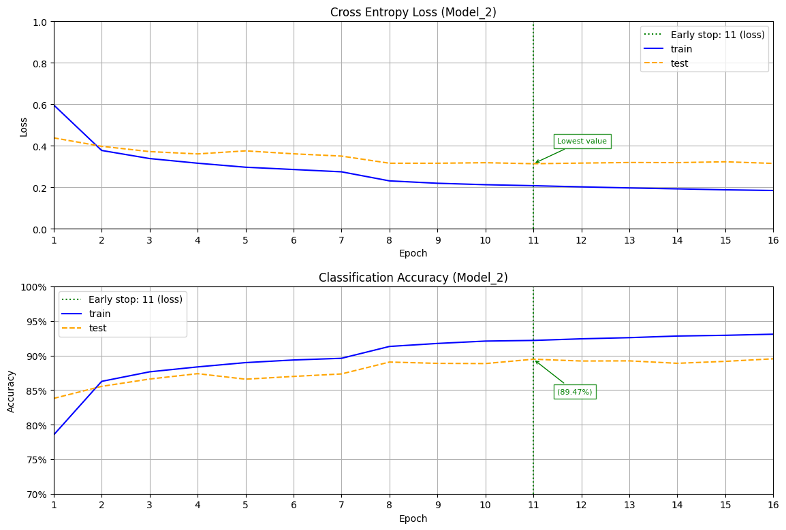
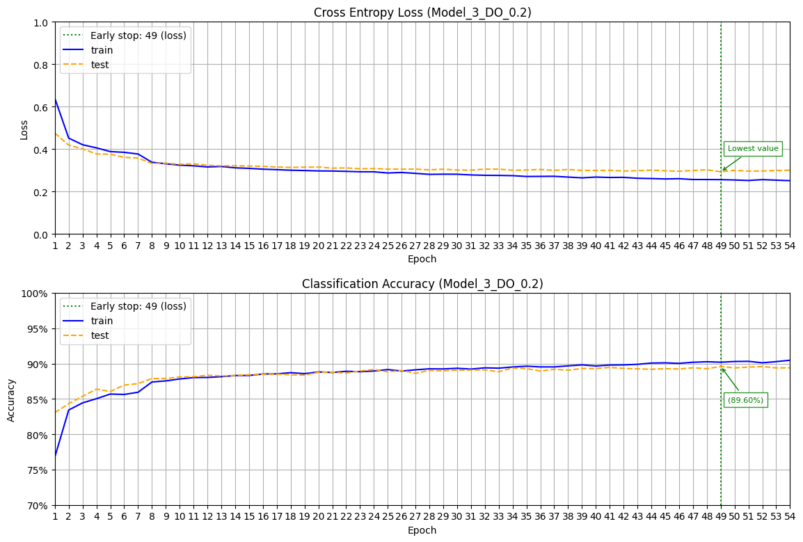
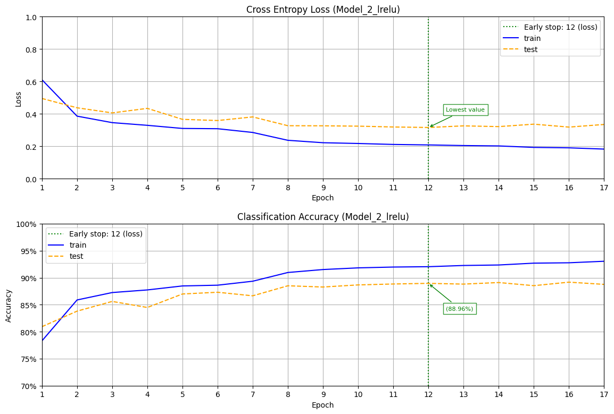
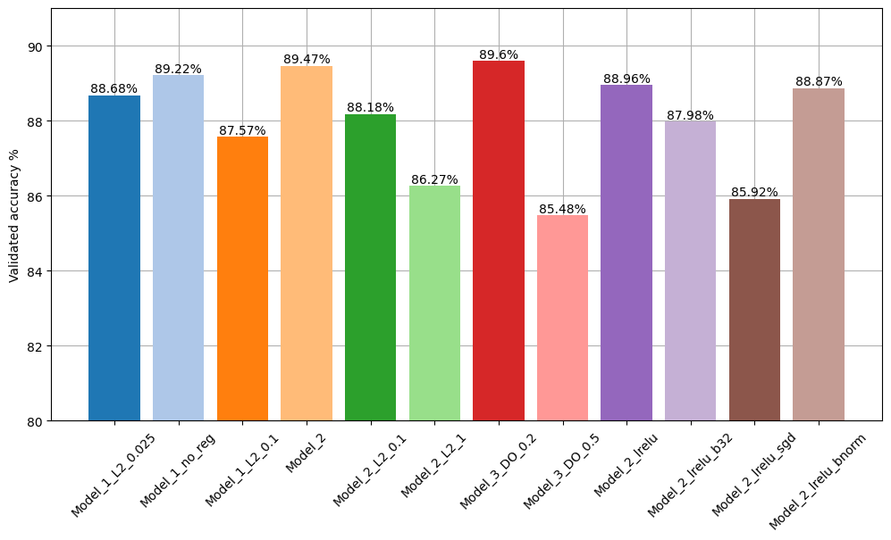

# Модуль 9.  Підбір гіперпараметрів НМ. Глибоке навчання. Tensorflow. Keras.

*З циклу [домашніх завдань Python Data Science](https://github.com/lexxai/goit_python_data_sciense_homework).*

# Домашнє завдання

В якості домашнього завдання вам пропонується створити нейронну мережу за допомогою механізмів Keras, яка буде класифікувати товари із датасету [fasion_mnist](https://www.tensorflow.org/datasets/catalog/fashion_mnist).

Вам належить запропонувати свою власну архітектуру мережі. Точність найнаївнішої, але адекватної нейромережі становить приблизно 91%. Точність вашої моделі повинна бути не нижчою за цей показник. Щоб досягти таких значень вам знадобиться поекспериментувати з гіперпараметрами мережі:

- кількість шарів;
- кількість нейронів;
- функції активації;
- кількість епох;
- розмір батчу;
- вибір оптимізатора;
- різні техніки регуляризації і т.д.

Використайте вивчені техніки виявлення проблем навчання нейронної мережі, і потім поекспериментуйте.

Рішення оформіть у вигляді окремого ноутбука.


# Результати

- [goit_python_ds_hw_09.ipynb](goit_python_ds_hw_09.ipynb)
- [Colab (goit_python_ds_hw_09.ipynb)](https://colab.research.google.com/drive/13IS9pP4JoGg4gH3kYhC9Qr0k8Lf2JpjB?usp=sharing)

## Типова архітектура нейронної мережі моделі 1.

```
_________________________________________________________________
 Layer (type)                Output Shape              Param #   
=================================================================
 INPUT (Flatten)             (None, 784)               0         
                                                                 
 Hidden_Layer_1 (Dense)      (None, 256)               200960    
                                                                 
 Hidden_Layer_2 (Dense)      (None, 512)               131584    
                                                                 
 Hidden_Layer_3 (Dense)      (None, 256)               131328    
                                                                 
 Hidden_Layer_4 (Dense)      (None, 32)                8224      
                                                                 
 OUTPUT (Dense)              (None, 10)                330       
                                                                 
=================================================================
Total params: 472426 (1.80 MB)
Trainable params: 472426 (1.80 MB)
Non-trainable params: 0 (0.00 Byte)
```

IL=784, HL1=256 (relu), HL2=512 (relu, L2) , HL3=256 (relu), HL4=32 (relu), OL=10 (softmax)

## Графік процесу навчання моделей












# Порівняння моделей




## Результати навчання (classification report)
```
Classification report for: 'Model_2'
                 precision    recall  f1-score   support

0 - T-shirt/top       0.79      0.92      0.85      1000
1 - Trouser           0.99      0.97      0.98      1000
2 - Pullover          0.80      0.81      0.80      1000
3 - Dress             0.88      0.89      0.89      1000
4 - Coat              0.76      0.86      0.81      1000
5 - Sandal            0.97      0.97      0.97      1000
6 - Shirt             0.81      0.59      0.68      1000
7 - Sneaker           0.95      0.95      0.95      1000
8 - Bag               0.99      0.96      0.97      1000
9 - Ankle boot        0.95      0.97      0.96      1000

       accuracy                           0.89     10000
      macro avg       0.89      0.89      0.89     10000
   weighted avg       0.89      0.89      0.89     10000

Accuracy: 88.80%
```

## Результати навчання (Confusion Matrix)


['0 - T-shirt/top', '1 - Trouser', '2 - Pullover', '3 - Dress', '4 - Coat', '5 - Sandal', '6 - Shirt', '7 - Sneaker', '8 - Bag', '9 - Ankle boot']

## Візуалізація результатів предбачення


# Висновок

Використано ряд моделей нейронних мереж для заданого набору данних "Fashion-MNIST".

Для порівняння та вибору найкращої моделі були побудовані декілька моделей з різною кількістю шарів, та різними значеннями гіперпараметрів.

Для забезпечення зупинення перенавчання моделі (overfit) застосовано додавання регуляризатора в одному з шарів типу L2, з різними значеннями. Також протестовано моделі на різних активаційних функціях таких як "relu", та "leaky_relu". 

Використано оптимізаційний алгоритм "Adam" для пошуку вагів. Крок навчання використанно динамічний в залежності він епохи. Залежність двоступенева - до 7 епохи 0.005, далі крок навчання дорівнює 0.001.

Для автоматичного зупинення пошуку нових ваг для моделі було застосовано "Early stop" як по метриці "val_loss" (min) patience=5, так і по метриці "val_accuracy" (max) patience=10.

Побудовані графіки залежностей для кожної з моделей, з відображенням найкращої епохи для вагів, котрі були вибранні. Де можна побачити тенденцію моделі до перенавчання.

Завдяки застосуванню "Early stop" загальні характеристики моделей у на діаграмі "Validated accuracy" певним чином вирівнялися, і перенавчання своєчасно було зупинено.

Вибір найкращої моделі базується на її простоті, швидкості та якості за мінімальними значеннями втрат "val_loss", та максимальним значенням якості "val_accuracy".

За вибраною моделлю "Model_2" побудовані випадкові передбачення для 10 зображень з тестової вибірки набору даних та результати побачення де червоний колір означає передбачення було помилкове.

За значеннями результатів confusion matrix бачимо що найгірша ситуація з прогнозуванням категорії 6 - 'Shirt' [Сорочка] яка має найбільшу кількість помилок з категорією 0 'T-shirt/top' [Футболка/Топ] та '4 - Coat' [Пальто], що і показала тестова вибірка.


