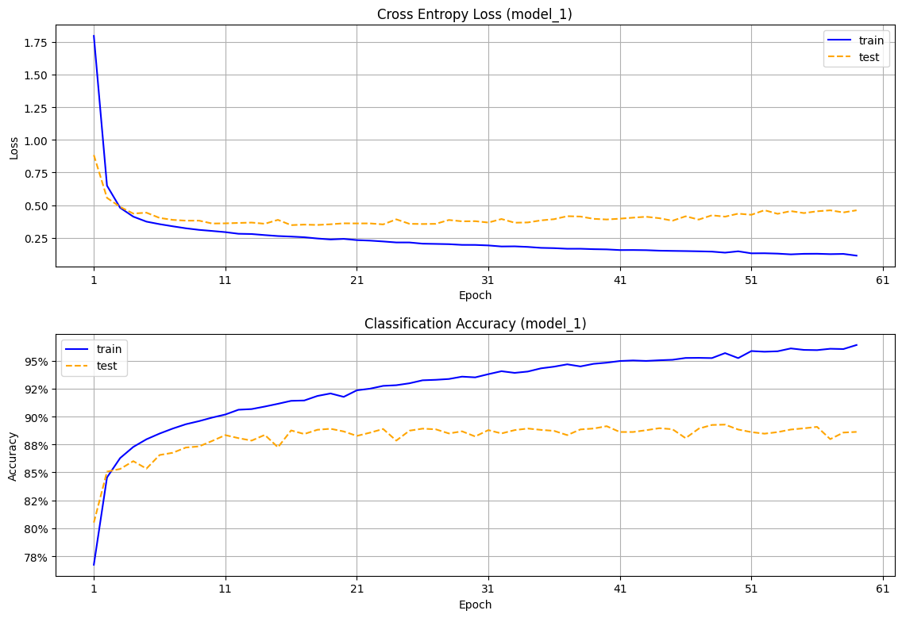
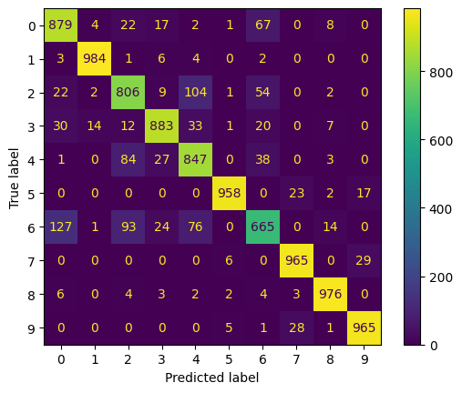
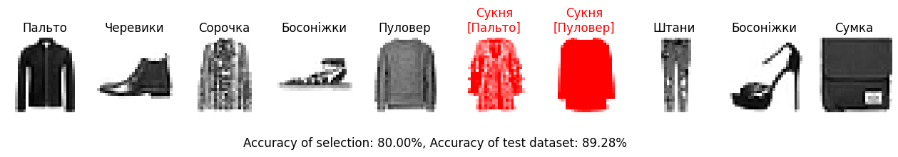

# Модуль 9.  Підбір гіперпараметрів НМ. Глибоке навчання. Tensorflow. Keras.

*З циклу [домашніх завдань Python Data Science](https://github.com/lexxai/goit_python_data_sciense_homework).*

# Домашнє завдання

В якості домашнього завдання вам пропонується створити нейронну мережу за допомогою механізмів Keras, яка буде класифікувати товари із датасету [fasion_mnist](https://www.tensorflow.org/datasets/catalog/fashion_mnist).

Вам належить запропонувати свою власну архітектуру мережі. Точність найнаївнішої, але адекватної нейромережі становить приблизно 91%. Точність вашої моделі повинна бути не нижчою за цей показник. Щоб досягти таких значень вам знадобиться поекспериментувати з гіперпараметрами мережі:

- кількість шарів;
- кількість нейронів;
- функції активації;
- кількість епох;
- розмір батчу;
- вибір оптимізатора;
- різні техніки регуляризації і т.д.

Використайте вивчені техніки виявлення проблем навчання нейронної мережі, і потім поекспериментуйте.

Рішення оформіть у вигляді окремого ноутбука.


# Результати

- [goit_python_ds_hw_09.ipynb](goit_python_ds_hw_09.ipynb)
- [Colab (goit_python_ds_hw_09.ipynb)](https://colab.research.google.com/drive/13IS9pP4JoGg4gH3kYhC9Qr0k8Lf2JpjB?usp=sharing)

## Архітектура нейронної мережі

```
_________________________________________________________________
 Layer (type)                Output Shape              Param #   
=================================================================
 INPUT (Flatten)             (None, 784)               0         
                                                                 
 Hidden_Layer_1 (Dense)      (None, 256)               200960    
                                                                 
 Hidden_Layer_2 (Dense)      (None, 512)               131584    
                                                                 
 OUTPUT (Dense)              (None, 10)                5130      
                                                                 
=================================================================
Total params: 337674 (1.29 MB)
Trainable params: 337674 (1.29 MB)
Non-trainable params: 0 (0.00 Byte)
```

IL=784, HL1=256 (relu), HL2=512 (relu, L2) , OL=10 (softmax)

## Графік процесу навчання




## Результати навчання (classification report)
```
precision    recall  f1-score   support

0 - T-shirt/top       0.81      0.88      0.84      1000
1 - Trouser           0.99      0.97      0.98      1000
2 - Pullover          0.84      0.74      0.79      1000
3 - Dress             0.88      0.90      0.89      1000
4 - Coat              0.72      0.90      0.80      1000
5 - Sandal            0.95      0.97      0.96      1000
6 - Shirt             0.77      0.60      0.68      1000
7 - Sneaker           0.95      0.93      0.94      1000
8 - Bag               0.97      0.97      0.97      1000
9 - Ankle boot        0.96      0.96      0.96      1000

       accuracy                           0.88     10000
      macro avg       0.88      0.88      0.88     10000
   weighted avg       0.88      0.88      0.88     10000

0.8817
```

## Результати навчання (Confusion Matrix)



## Візуалізація результатів предбачення


